<!-- PROFILE-CARDS:START -->

 
<table>
  <tr>
    <td width="52.0%" valign="top"></td>
    <td width="48.0%" valign="top"></td>
  </tr>
</table>
 

 

 

 

<!-- PROFILE-CARDS:END -->

# rishabh-tiwari